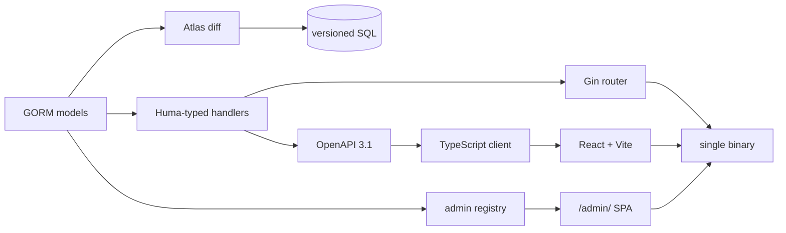

# Gombit

[](https://github.com/gombit-dev/gombit/actions/workflows/ci.yml)
[](https://github.com/gombit-dev/gombit/actions/workflows/release.yml)
[](https://go.dev/dl/)
[](LICENSE)
[](https://pkg.go.dev/github.com/gombit-dev/gombit)

**A Django-for-Go full-stack framework.** One CLI scaffolds a typed Go API, its
OpenAPI document, a matching TypeScript client, a React frontend, versioned SQL
migrations, session auth, and a working admin — then builds the whole thing into
a single binary.

```bash
go install github.com/gombit-dev/gombit/cmd/gombit@latest
gombit new tasks --database sqlite --auth cookie --ui mui
cd tasks && gombit dev
```

> **Status: pre-1.0.** M0–M5 and ADMIN-1..3 are complete and CI-gated across
> SQLite, PostgreSQL, and MySQL. APIs may still change between minor versions.

## Why Gombit

Go has excellent HTTP routers. What it doesn't have is the thing Django users
miss on day one: the **batteries**, wired together and agreeing with each other.

Gombit's position is that the pieces you'd otherwise assemble by hand — schema,
API contract, typed client, auth, admin — should be **derived from one source of
truth** instead of hand-synchronized:

- **Your handler signature is the contract.** OpenAPI 3.1 is emitted from
  Huma-typed handlers, never hand-written, and the TypeScript client is
  generated from that. A drift check fails CI when they disagree.
- **Your GORM model is the schema.** Migrations are versioned SQL diffed by
  Atlas from your models — readable, reviewable, and reversible. No
  `AutoMigrate` in production, no hand-rolled migration DSL.
- **Your registry is the admin.** A real Django-style admin at `/admin/`,
  served by the framework at runtime, not generated pages you inherit and
  maintain.

And the escape hatches are real: `app.Router()` hands you the raw `*gin.Engine`,
tested and first-class.

## What's in the box

| | |
| --- | --- |
| **Runtime** | Gin + [Huma](https://huma.rocks/) with typed handlers, `framework.App` lifecycle hooks, graceful shutdown, structured logging, typed env config with secret redaction |
| **Data** | GORM over **SQLite, PostgreSQL, and MySQL** — all three CI-gated on every push, with a shared conformance suite |
| **Migrations** | [Atlas](https://atlasgo.io/)-backed `gombit db makemigrations / migrate / rollback / status / seed / reset` |
| **Contract** | OpenAPI 3.1 emitted from code, interactive `/docs`, generated TypeScript client, contract drift check |
| **Frontend** | Vite + React + TypeScript, React Hook Form, optional Material UI CRUD preset (`--ui mui`) |
| **Auth** | Bearer JWT with refresh rotation (token in memory, **never `localStorage`**), or first-class cookie sessions with CSRF (`--auth cookie`) |
| **Admin** | Runtime generic admin at `/admin/` with introspection API, permissions, groups, and superuser bypass |
| **CLI** | Cobra tree: `new`, `dev`, `build --embed`, `make resource`, `make command`, `db`, `openapi`, `client`, `routes`, `doctor`, `config`, `createsuperuser`, `version` |
| **Deploy** | `gombit build --embed` — API, SPA, and admin in one binary |

## Quick start

**Prerequisites:** Go 1.25+, Node 22+, and a C toolchain (SQLite is cgo-only).
Migrations also need [Atlas](https://atlasgo.io/):
`curl -sSf https://atlasgo.sh | sh -s -- --community`. Full details in
[installation.md](docs/installation.md).

```bash
# 1. Install
go install github.com/gombit-dev/gombit/cmd/gombit@latest

# 2. Scaffold
gombit new tasks --database sqlite --auth cookie --ui mui
cd tasks

# 3. Run the API and frontend together
gombit dev
```

`gombit dev` serves the Go API and Vite together, proxies `/api` and
`/openapi.json`, and regenerates the TypeScript client whenever the spec
changes:

| URL | |
| --- | --- |
| <http://127.0.0.1:5173> | React app |
| <http://127.0.0.1:8080/docs> | interactive API docs |
| <http://127.0.0.1:8080/admin/> | admin SPA |

### The CRUD loop

```bash
# Generate a feature package: model + Huma handler + routes + React pages.
gombit make resource Task title:string:required done:bool

# Diff your models into versioned SQL, then apply it.
gombit db makemigrations create_tasks --model github.com/example/tasks/internal/task.Task
gombit db migrate

# Regenerate the typed client from the live spec.
gombit client generate

# Create an admin account and open /admin/.
export GOMBIT_JWT_SECRET="$(openssl rand -hex 32)"
gombit createsuperuser --email admin@example.com
```

`make resource` edits `cmd/server/main.go` through `go/ast` — never regex — to
register your routes and models. Generators are idempotent and additive, support
`--dry-run` and `--force`, and never overwrite files you own.

Then ship it:

```bash
gombit build --embed   # one binary: API + SPA + admin
```

**Next:** the [tutorial](docs/tutorial.md) walks this whole loop with
explanations, and [`examples/tutorial/`](examples/tutorial) is the finished app.

## Architecture



Both arrows out of your model are the point: one declaration drives the schema
and the API, and one API drives the client.

The response envelope is fixed so clients can rely on it — success is
`{"data": ..., "meta"?: ...}`, and errors carry a machine-readable code plus
per-field detail:

```json
{
  "error": {
    "code": "validation_error",
    "message": "The request contains invalid fields.",
    "fields": {"title": ["expected length >= 1"]},
    "request_id": "5db935cd-7c74-4ffe-a4de-0fa817451f54"
  }
}
```

## The admin

No other Go web framework ships a real Django-style admin — not Gin, Echo,
Fiber, or Encore. Gombit's is a **runtime** surface over an explicit registry:

```go
admin.Register(app, Task{}, admin.Options{
	Slug:   "tasks",
	List:   []string{"title", "done"},
	Search: []string{"title"},
})
```

That gives you list, detail, create, update, and delete at `/admin/`, backed by
`GET /api/v1/admin/meta` and a generic `/api/v1/admin/resources/{slug}` data
plane. Permissions default to `admin.{slug}.{action}`, are granted directly or
through groups, and superusers bypass them.

Registration is explicit and typed — resolved once at startup, with no
request-time reflection over your models, and no generated admin pages for you
to maintain. Requires cookie auth. See [admin.md](docs/admin.md) and
[ADR-013](docs/adr/013-runtime-generic-admin.md).

## Compared with

| | Gombit | Gin / Echo / Fiber | Buffalo | Encore |
| --- | --- | --- | --- | --- |
| HTTP routing | ✅ (Gin) | ✅ | ✅ | ✅ |
| Typed OpenAPI from code | ✅ | ➖ add-on | ➖ | ✅ |
| Generated TS client + drift check | ✅ | ➖ | ➖ | ✅ |
| Versioned SQL migrations | ✅ (Atlas) | ➖ | ✅ (fizz) | ✅ |
| Scaffolding generators | ✅ AST-safe | ➖ | ✅ | ➖ |
| Session auth + CSRF | ✅ | ➖ | ✅ | ➖ |
| **Django-style admin** | ✅ | ➖ | ➖ | ➖ |
| Self-hosted, no vendor runtime | ✅ | ✅ | ✅ | ➖ |

Gombit is younger than all of them. If you want a minimal router, use Gin
directly — Gombit *is* Gin underneath, and hands it back to you on request.

## Performance

The [`benchmarks/`](benchmarks/) suite measures the same canonical
`/api/projects` CRUD app across six stacks (Gin+GORM, Gombit, Django, Rails,
Laravel, NestJS) under fixed resource limits, plus each container's operational
footprint. The block below is generated by `make benchmark-report` from
`benchmarks/results/latest/` — do not edit it by hand; `make
benchmark-report-check` fails if it drifts from the data. **Read
[the methodology](benchmarks/docs/methodology.md), especially
"How not to interpret these results", before citing any figure:** these are
same-host, closed-loop numbers, not a cross-language leaderboard.

<!-- benchmark-results:start -->
_Generated by `make benchmark-report` from `benchmarks/results/latest/` — do not edit by hand._

Numbers are a same-host, closed-loop snapshot under fixed resource limits; read [benchmarks/docs/methodology.md](benchmarks/docs/methodology.md) — especially its "How not to interpret these results" section — before citing any figure.

### Framework tax — `net/http` → Gin → Huma → Gombit

Per-request overhead of each layer on the same machine (ns/op, B/op, allocs/op; lower is better) — the same-language, same-runtime cost of adopting Gombit.

_Not yet recorded — run `go test ./benchmarks/micro/... -bench=BenchmarkFrameworkTax -benchmem -count=10` (persisting these rows to the report is a follow-up)._

### PostgreSQL CRUD read — `GET /api/projects?page=1&limit=20`

_Not yet recorded — run `make benchmark-crud-all`._

### Operational footprint

Container-start cold start (median) and memory — lower is better. CPU is the median percent one container drew during the closed-loop load (100 = one core); it is *not* a quality score — a faster app that does more work in the window can show higher CPU, so read it against the throughput row.

_Not yet recorded — run `make benchmark-footprint`._

### How these were measured

_Run metadata not yet recorded._
<!-- benchmark-results:end -->

## Documentation

Start with [**installation**](docs/installation.md) and the
[**tutorial**](docs/tutorial.md). The full index — runtime, data, contract,
frontend, auth, admin, and ADRs — is at [**docs/README.md**](docs/README.md).

Scope, locked architecture decisions, and the issue backlog live in
[`docs/GOMBIT_BUILD_PLAN.md`](docs/GOMBIT_BUILD_PLAN.md), which is authoritative.

## Roadmap

**Shipped:** typed config and lifecycle (M1) · Atlas migrations (M2) · Huma
contract, OpenAPI, and TS client (M3) · Cobra CLI and generators (M4) · React
frontend, Bearer and cookie auth, MUI preset, embedded builds (M5) · the runtime
admin with permissions (ADMIN-1..3).

**Post-v0.1**, deliberately not here yet: background jobs and queues, events,
scheduler, mail, storage, gRPC, multi-tenancy, i18n.

## Contributing

Issues and pull requests are welcome — start with
[CONTRIBUTING.md](CONTRIBUTING.md).

- [Report a bug or request a feature](https://github.com/gombit-dev/gombit/issues/new/choose)
- [Security policy](SECURITY.md) — report vulnerabilities privately, not as issues
- [Code of conduct](CODE_OF_CONDUCT.md)
- [Changelog](CHANGELOG.md)

## License

[MIT](LICENSE) © Gombit
